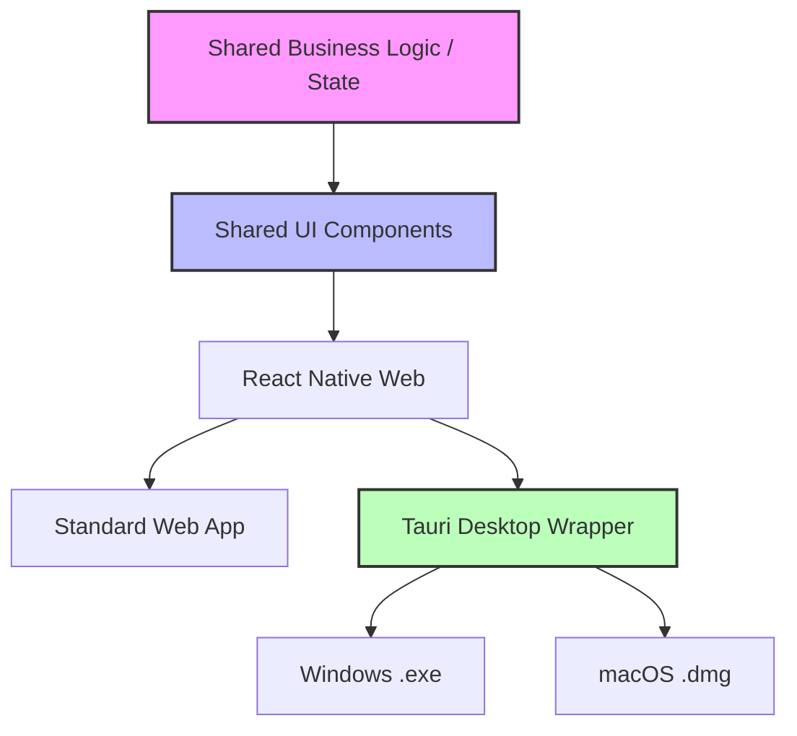

# 🏦 Kiosk Banking: Enterprise Self-Service Solution

[](https://github.com/achyuthkp/kiosk)
[](https://reactnative.dev/)
[](LICENSE)

A premium, production-grade Banking Kiosk Application designed for high-traffic self-service environments. Built with a unified codebase, it delivers a seamless, native-grade experience across **Web**, **Windows**, and **macOS** with a focus on security, accessibility, and touch-first interaction.

---

## 📖 Project Overview

This application serves as a comprehensive self-service banking hub. It allows customers to perform critical banking operations—such as checking statements, ordering cheque books, transferring funds, and paying bills—without teller assistance. 

Designed specifically for **Kiosk Mode**, the app features a locked-down interface, virtual keyboard integration, and multi-language support to cater to diverse user bases in physical bank branches, airport lounges, and retail centers.

---

## 🏗️ Architecture

The project leverages a modern, high-performance stack to achieve truly cross-platform delivery from a single codebase.

### Technical Stack
- **Frontend Core**: [React Native](https://reactnative.dev/) & [Expo](https://expo.dev/)
- **Web Rendering**: [React Native Web](https://necolas.github.io/react-native-web/)
- **Desktop Wrapper**: [Tauri](https://tauri.app/) (Rust-based security and performance)
- **UI System**: [Material UI (MUI)](https://mui.com/) tailored for touch interactions
- **Animations**: [Framer Motion](https://www.framer.com/motion/)
- **Language**: [TypeScript](https://www.typescriptlang.org/) for type safety

### Single-Codebase Strategy


### Key Components
- **`src/components/keyboard`**: Custom virtual keyboard system for secure, physical-keyboard-free entry.
- **`src/context/LanguageContext`**: Global state for on-the-fly language switching (En, Es, Nl).
- **`src-tauri`**: Rust backend configuration for hardware-level window control and kiosk lockdown.

---

## ✨ Features

- **🔐 Secure Authentication**: Multi-factor flow using User ID, Date of Birth (auto-formatted), and OTP.
- **📊 Dashboard**: Personalized overview with session management and quick-access tiles.
- **📑 Account Statement**: Rich data visualization of transaction history.
- **✉️ Cheque Book Management**: Step-by-step wizard for ordering new leaves with address verification.
- **💸 Fund Transfer**: Secure inter-account and external banking transfers with OTP confirmation.
- **📱 Bill Payment**: Integrated biller directory for utility and service payments.
- **⌨️ Virtual Keyboard**: Context-aware OSK (On-Screen Keyboard) with physical keyboard sync.
- **🌍 Multilingual**: Internationalization support for English, Spanish, and Dutch.
- **🛡️ Kiosk Mode**: Fullscreen execution with disabled OS gestures and navigation.

---

## 🎨 UI/UX Philosophy

The design mimics the high-stakes, high-reliability feel of a modern ATM or airport kiosk.

- **Touch-First Layout**: Oversized hit areas, generous spacing, and no reliance on "hover" states.
- **Material Design 3**: Leveraging the latest MUI theme for a "Clean, Trusted, and Efficient" aesthetic.
- **Motion & Feedback**: Subtle micro-interactions and transitions to guide the user through complex banking flows.
- **Accessibility**: High-contrast ratios, large typography, and screened layouts for readability in various lighting conditions.

---

## 🚀 Setup & Installation

### Prerequisites
- Node.js (v18+)
- Rust & Cargo (for Tauri desktop builds)
- [Expo CLI](https://docs.expo.dev/get-started/installation/)

### Installation
1. **Clone the repository:**
   ```bash
   git clone https://github.com/achyuthkp/kiosk.git
   cd kiosk
   ```

2. **Install dependencies:**
   ```bash
   npm install
   ```

3. **Run on Web (Development):**
   ```bash
   npm run web
   ```

4. **Run on Desktop (Tauri Dev):**
   ```bash
   npm run desktop
   ```

---

## 📦 Build & Packaging

The build system automatically handles platform-specific configurations. No manual config changes required!

### Quick Commands

| Platform | Command | Output |
|----------|---------|--------|
| **Desktop (Tauri)** | `npm run build:tauri` | `.app` / `.exe` / `.deb` |
| **GitHub Pages** | `npm run build:ghpages` | Static web bundle |
| **Web (General)** | `npm run build:web` | `dist/` folder |

### Desktop Installers (Tauri)

Build native desktop apps with a single command:

```bash
# macOS (Apple Silicon & Intel)
npm run build:tauri

# Windows (cross-compile or on Windows)
npm run tauri build -- --target x86_64-pc-windows-msvc

# Linux (AppImage, .deb)
npm run tauri build -- --target x86_64-unknown-linux-gnu
```

**Output locations:**
- macOS: `src-tauri/target/release/bundle/macos/kiosk.app`
- Windows: `src-tauri/target/release/bundle/msi/kiosk.msi`
- Linux: `src-tauri/target/release/bundle/appimage/`

### GitHub Pages Deployment

Generates a static bundle with the correct base path (`/cross-platform-kiosk-banking`):

```bash
npm run build:ghpages
```

Then deploy the `dist/` folder to GitHub Pages.

### Mobile (iOS & Android)

```bash
# iOS (requires Mac with Xcode)
npm run ios

# Android (requires Android Studio)
npm run android
```

> [!TIP]
> The `app.config.js` handles build target detection automatically via the `BUILD_TARGET` environment variable.

---

## 🛡️ Security Notes

- **OTP Flow**: Mandatory re-authentication for high-risk actions (Transfers, Cheque Books).
- **Session Timeout**: Automatic logout after inactivity to prevent unauthorized access.
- **Data Masking**: Account numbers and sensitive IDs are partially masked in the UI.
- **No Persistence**: No sensitive banking data is stored locally on the kiosk disk.

---

## 📸 Screenshots & GIFs

| Landing Screen | Login & Keyboard | Dashboard |
| :---: | :---: | :---: |
|  |  |  |

| Account Statement | Fund Transfer | Bill Payment |
| :---: | :---: | :---: |
|  |  |  |

---

## 👨‍💻 Development Workflow

- **Shared Components**: Add new UI elements to `src/components/`. Use `KioskPage` as a wrapper for consistent layout.
- **Translations**: Add keys to `src/i18n/translations.ts` to support all locales simultaneously.
- **Styling**: All themes are centralized in `src/theme/Theme.ts`. Do not use inline styles.
- **Type Safety**: New modules MUST have defined types/interfaces for props and state.

---

## 🤝 Contribution & Extension

We welcome contributions to expand the kiosk ecosystem!
1. Fork the Project.
2. Create your Feature Branch (`git checkout -b feature/AmazingFeature`).
3. Commit your Changes (`git commit -m 'Add some AmazingFeature'`).
4. Push to the Branch (`git checkout origin feature/AmazingFeature`).
5. Open a Pull Request.

---

*Developed with ❤️ for the Future of Banking.*
