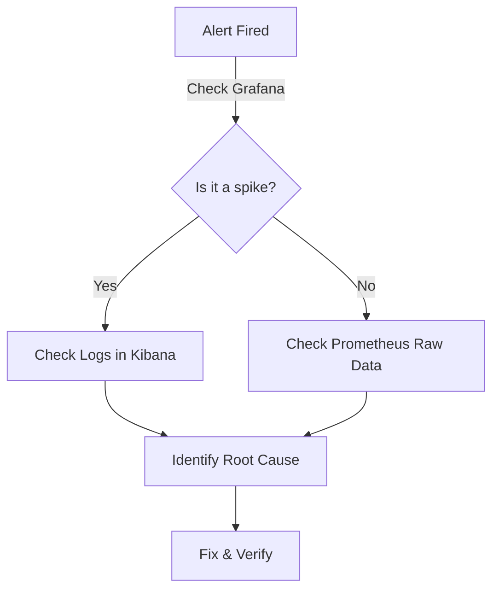

# Grafana & Prometheus: The Observability Cockpit

> [!NOTE]
> **Prometheus** collects the numbers (metrics) from your application.
> **Grafana** visualizes those numbers into beautiful, actionable dashboards.

---

## 1. Accessing the Tools

| Tool           | URL                     | Default Creds     |
| :------------- | :---------------------- | :---------------- |
| **Grafana**    | `http://localhost:3000` | `admin` / `admin` |
| **Prometheus** | `http://localhost:9090` | None              |

---

## 2. Grafana: How to Check Metrics

### 🔍 Exploring Dashboards

1. **Login** to Grafana.
2. Navigate to **Dashboards** > **Browse**.
3. Open the **Spring Boot 3.x Statistics** dashboard (standard for Java apps).

### 📈 Key Panels to Watch

- **Uptime**: Is the app constantly restarting? (Bad)
- **Heap Memory**: Is the "Used" line climbing until it hits "Max"? (Memory Leak)
- **CPU Usage**: Spikes > 80% indicate load or infinite loops.

### 🔔 Setting Alerts

1. Click the title of any panel (e.g., "Error Rate").
2. Select **Edit** > **Alert** tab.
3. specific condition: `WHEN max() OF query(A) IS ABOVE 5%`.

---

## 3. Prometheus: Power User Queries (PromQL)

If Grafana is the dashboard, Prometheus is the raw engine. Use these queries in the Prometheus UI `Expression` bar.

### Basic Health

```promql
# Is the backend up? (1 = Yes, 0 = No)
up{job="kiosk-backend"}
```

### 🔴 RED Method (Requests, Errors, Duration)

**R - Rate (Requests per second)**

```promql
rate(http_server_requests_seconds_count[1m])
```

**E - Errors (Percentage of 500s)**

```promql
sum(rate(http_server_requests_seconds_count{status=~"5.."}[1m]))
/
sum(rate(http_server_requests_seconds_count[1m]))
```

**D - Duration (95th Percentile Latency)**

```promql
histogram_quantile(0.95, sum(rate(http_server_requests_seconds_bucket[1m]) by (le)))
```

---

## 4. Troubleshooting Workflow


