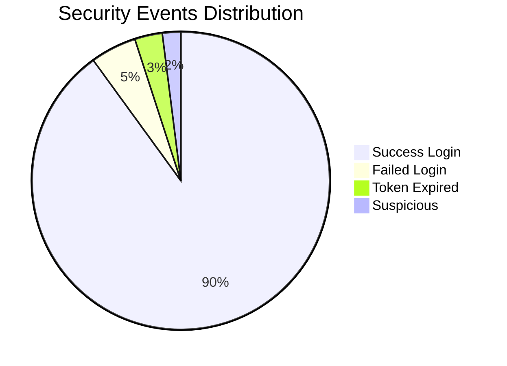

# Kubernetes & Container Metrics

> [!NOTE]
> Even if running in Docker Compose, these concepts translate directly to Pods in K8s. These metrics tell you about the **Infrastructure** health.

---

## 1. Pod / Container Health

These metrics measure the "box" your app lives in.

### 🔴 Critical Signals

| Metric                  | Description                                                    | PromQL Example                                                    |
| :---------------------- | :------------------------------------------------------------- | :---------------------------------------------------------------- |
| **Pod CPU Usage**       | How much processing power is consumed.                         | `rate(container_cpu_usage_seconds_total[1m])`                     |
| **Pod Memory Usage**    | RAM consumed. If this hits limit -> **OOM Kill**.              | `container_memory_usage_bytes`                                    |
| **Pod Restarts**        | Connection to stability. High restarts = **CrashLoopBackOff**. | `kube_pod_container_status_restarts_total`                        |
| **Container OOM Kills** | The Kernel killed your app to save the node.                   | `kube_pod_container_status_terminated_reason{reason="OOMKilled"}` |

> [!WARNING]
> **OOM Kills** are silent killers. The app just vanishes and restarts. Always alert on `OOMKilled > 0`.

---

## 2. Node & Scaling Metrics

### Node Resource Pressure

- **What it is**: The physical server (Node) is running out of CPU/RAM.
- **Impact**: Kubernetes will stop scheduling new pods on this node (Taint/Eviction).

### HPA Scaling Events (Horizontal Pod Autoscaler)

- **Trigger**: When CPU > Target (e.g., 80%).
- **Action**: K8s adds more replicas (Pods).
- **Metric**: `kube_horizontalpodautoscaler_status_current_replicas`

---

## 3. Reliability & Resilience (SRE Concepts)

### The SRE Dictionary

| Term             | Full Name               | Definition                                       | Example                                  |
| :--------------- | :---------------------- | :----------------------------------------------- | :--------------------------------------- |
| **SLI**          | Service Level Indicator | The _actual_ number you measure.                 | "99.5% of requests succeed"              |
| **SLO**          | Service Level Objective | The _target_ you want to hit.                    | "99.9% availability"                     |
| **SLA**          | Service Level Agreement | The _contract_ (money lost if missed).           | "Refund if < 99.0%"                      |
| **Error Budget** | SLO - Actual            | How much more you can fail before violating SLO. | "We can fail 100 more times this month." |

### Resilience Patterns

- **Circuit Breaker State**:
    - `CLOSED`: Normal operation.
    - `OPEN`: Failing to protect downstream. (Fast failure).
    - `HALF_OPEN`: Testing if downstream is back up.
- **Retry Count**: How many times we tried again. High retries = High Latency.
- **Timeout Rate**: Requests cut off because they took too long.

---

## 4. Security & Audit Metrics

These are custom business metrics for safety.

- **Auth Failures**: Brute force attack detection.
- **Token Expiry Rate**: Are sessions too short? Users annoyed?
- **Suspicious Request Rate**: Spikes in `401 Unauthorized` or `403 Forbidden`.
- **Audit Event Volume**: Total number of business actions (Logins, Transfers) recorded.

